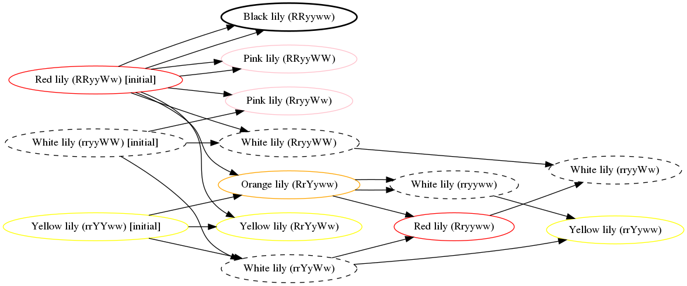
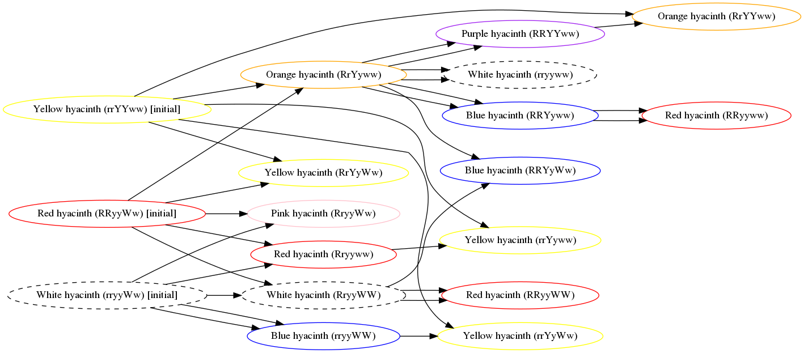
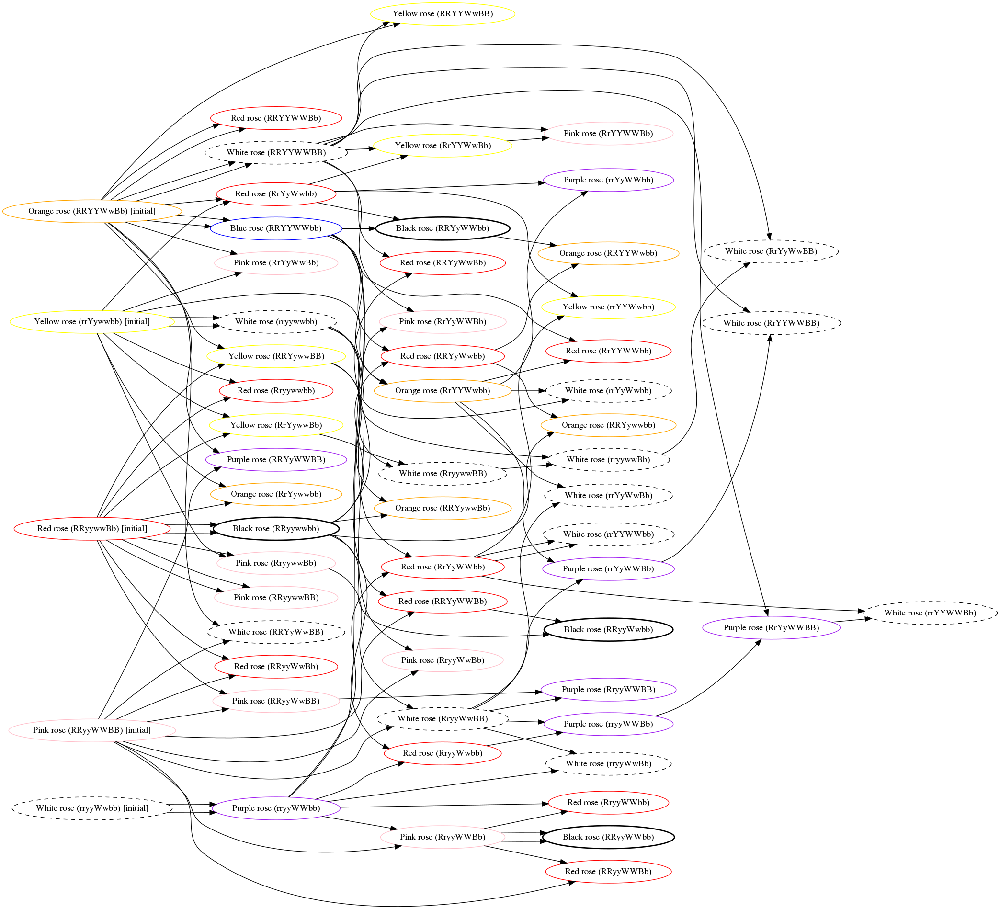

# AC:NH Flower Breeder

This is a library/binary for working with flower genetics in Animal Crossing: New Horizons.

Unlike past games, each flower in ACNH tracks either three or four genes. These genes determine the colour of the flower, as well as the genetics (and thus colour) of its offspring.

## Goals

The main goal of this library, apart from being generally useful, is to provide a path to any given flower colour starting from seeds with as little guesswork as possible.

For all flowers but roses, starting from seeds and carefully tracking lineage, you can breed a flower of every colour with no guesswork, and chance only limited to convincing two flowers to give you a child of a 'safe' colour.

For roses, you can reach all colours this way except blue.

## Breeding plans

### Tulip

### Lily

### Hyacinth

### Cosmo

### Pansy

### Mum

### Windflower

### Rose (seeds only)

### Rose (seeds and wild flowers)

